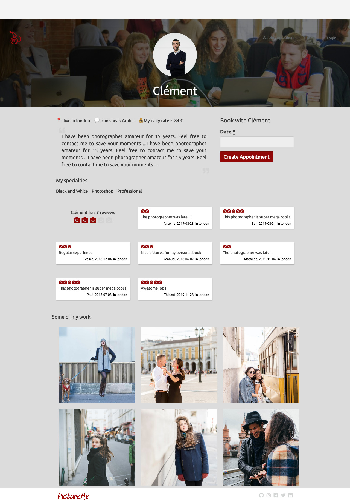

# PictureMe
Projet réalisé en équipe de 4 personnes pendant la septième semaine (en 5 jours) de la formation Le Wagon à Lisbonne. PictureMe est une marketplace *Airbnb-like* qui permet à des photographes de proposer leurs services à destinations de professionnels ou particuliers qui souhaitent immortaliser un évènement ou un moment.

J'ai principalement travaillé sur la show page de profil des photographes :

Application Rails générée à partir du template [lewagon/rails-templates](https://github.com/lewagon/rails-templates), créé par [Le Wagon coding bootcamp](https://www.lewagon.com).
